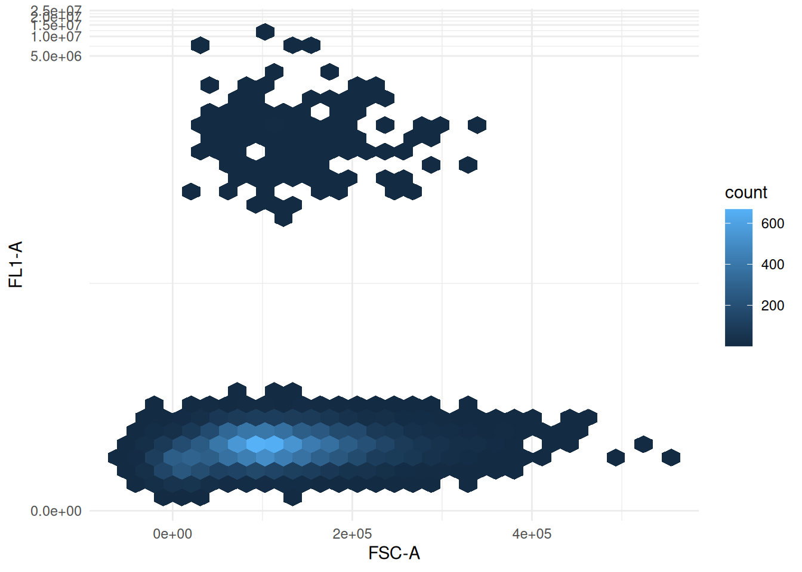

# Synthetic flow cytometry data

``` r

library(flod)
#> NB! `flod` is under heavy development and subject to sweeping changes
library(ggplot2)
```

``` r

con <- DBI::dbConnect(duckdb::duckdb(), system.file("extdata", "synthetic_data.duckdb", package = "flod"))
tables <- DBI::dbListTables(con)
tables
#> [1] "experiment1" "experiment2" "experiment3" "experiment4" "experiment5"
#> [6] "experiment6" "experiment7" "experiment8"
```

``` r

sample1 <- DBI::dbGetQuery(con, "
  SELECT unnest(exprs, recursive := true) FROM experiment1 WHERE rowid = 0
")
head(sample1)
#>       FSC-A    FL1-A     SSC-A      FSC-H        FL2-A        FL3-A Live Size
#> 1  85189.09 3.539362 127933.34 122455.713 3.447852e+00 4.473841e+00 TRUE TRUE
#> 2  41024.00 3.449730 116147.97  73719.101 1.182515e+05 5.948978e+05 TRUE TRUE
#> 3  92841.13 6.393925  57975.30  86880.297 8.905762e+00 6.506209e+00 TRUE TRUE
#> 4 154134.01 9.683125 164429.49 119093.447 4.653416e+05 3.388962e+00 TRUE TRUE
#> 5  37446.95 4.592779 149464.90  -9397.347 4.643874e+00 2.636371e+00 TRUE TRUE
#> 6  66670.31 5.561639  25306.59  45837.690 2.562517e+05 6.503017e+00 TRUE TRUE
#>   Singlet FL2_positive FL3_positive
#> 1    TRUE        FALSE        FALSE
#> 2    TRUE         TRUE         TRUE
#> 3    TRUE        FALSE        FALSE
#> 4    TRUE         TRUE        FALSE
#> 5    TRUE        FALSE        FALSE
#> 6    TRUE         TRUE        FALSE
```

``` r

ggplot(sample1, aes(x = `FSC-A`, y = `FL1-A`)) +
  geom_hex() +
  theme_minimal() +
  scale_y_continuous(transform = "asinh")
```


